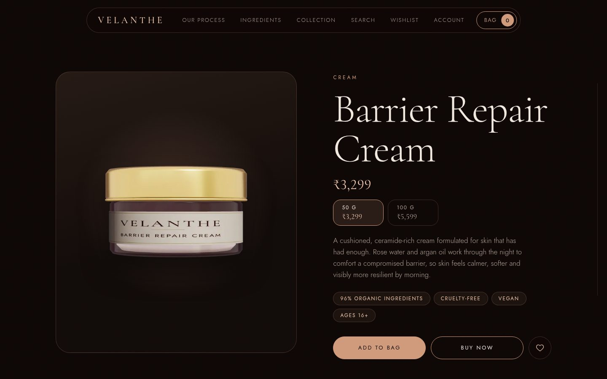
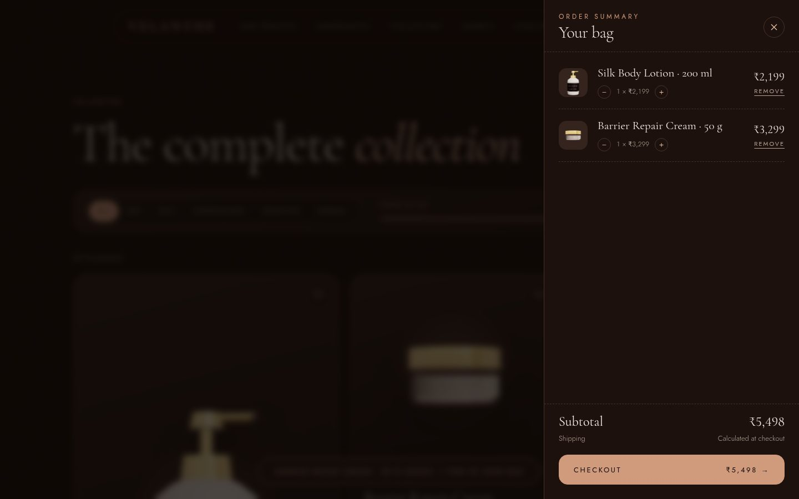

# Velanthe

A portfolio e-commerce site for Velanthe, an invented luxury skincare brand. Browse the catalog, add items to a bag and wishlist, search, sign in with a Supabase account (or stay a guest), place a mock order and see it in order history.

**Live URL:** https://velanthe.vercel.app

## Screenshots

<table>
<tr>
<td width="50%"><br><sub>Home</sub></td>
<td width="50%"><br><sub>Collection &amp; filters</sub></td>
</tr>
<tr>
<td width="50%"><br><sub>Product page</sub></td>
<td width="50%"><br><sub>Bag drawer</sub></td>
</tr>
</table>

## Stack

- Next.js 15 (App Router), React 19, plain JavaScript
- Tailwind CSS v4 plus the design's own stylesheet (`src/app/globals.css`)
- three.js (3D bottles and the "making of" scene), GSAP (scroll animation) and Lenis (smooth scrolling). They load only on the home page.
- Zustand for the bag and wishlist (saved in the browser; for signed-in users also saved in Supabase)
- Supabase for accounts, the synced bag and wishlist, and orders — optional; the store works without it
- Node's built-in test runner for unit tests (no test framework to install)

## Requirements

- Node 22.12+ and npm
- Windows, macOS or Linux
- Current Chrome, Edge, Firefox, or Safari 17+

## Run locally

Without Supabase the site is a complete guest store (catalog, bag, wishlist, search). Sign-in, checkout, order history and password reset need Supabase.

```bash
npm install
npm run dev
```

Open http://localhost:3000.

## Enable accounts (Supabase, optional)

1. supabase.com → New project (free tier).
2. Project Settings → API: copy the **Project URL**, **anon public** key and **service_role** key. (Newer Supabase projects show "Publishable" and "Secret" keys instead — those work the same way here; use whichever your project's API Keys page shows.)
3. Authentication → Providers → Email: turn **off** "Confirm email".
4. Authentication → URL Configuration: Site URL = your site's URL; add `http://localhost:3000/**` and your site's URL `/**` as redirect URLs.
5. Authentication → Users → Add user: `demo@example.com` with a password you choose.
6. SQL editor: run `supabase/schema.sql` once (creates the `bag_items`, `wishlist_items` and `orders` tables and their security rules).
7. Copy `.env.example` to `.env.local` (macOS/Linux: `cp .env.example .env.local`, Windows: `copy .env.example .env.local`) and fill in the values.
8. Optional check of the security rules (users can't write orders or other people's rows): `node --env-file=.env.local scripts/rls-check.mjs`

The demo account is shared by everyone who uses it. To reset its password: Supabase → Authentication → Users.

**Already ran `schema.sql` before the "cancel order" feature was added?** It added a `status` column to `orders`. Run this once in the SQL editor to catch up (safe to run on an existing table; it does nothing if the column is already there):

```sql
alter table public.orders add column if not exists status text not null default 'placed' check (status in ('placed', 'cancelled'));
```

## Scripts

| Command | Does |
|---|---|
| `npm run dev` | Dev server |
| `npm run build` / `npm start` | Production build / serve it |
| `npm test` | Unit tests (`node --test`; `scripts/register-alias.mjs` lets it understand the `@/` import shortcut) |
| `node --env-file=.env.local scripts/rls-check.mjs` | Check Supabase's security rules |

## Deploy to Vercel

1. Push the repo to GitHub and import it in Vercel.
2. Add the variables from `.env.example` in Vercel → Settings → Environment Variables (skip the Supabase ones for a guest-only store).
3. Set `NEXT_PUBLIC_SITE_URL` to the production URL and redeploy.

## Keep-alive

Supabase free projects pause after about a week without use. `.github/workflows/keepalive.yml` pings `/api/health` twice a week. After pushing to GitHub, add a repository secret named `SITE_URL` (your production URL, no trailing slash); the job fails until it is set. GitHub also pauses scheduled jobs in a repo with no activity for 60 days, so re-enable it or run it manually after a long break.

## Notes

- Checkout is a **mock**: no payment is taken. The server prices every order from the catalog; prices sent by the browser are ignored.
- Orders can be cancelled from the order page while they're still "Placed" (`src/app/account/orders/actions.js`). There is no shipping to track in this demo, so cancelling is the only status change; a cancelled order stays visible, marked in order history. Users have no direct database permission to change an order — cancelling goes through a server action, the same as placing one.
- Guests: the bag and wishlist are saved in that browser. Signed-in users: they are saved in Supabase and follow the account across devices. When a guest logs in, the two bags are merged (the larger quantity per product wins).
- Password reset: the login page's "Forgot password?" sends a Supabase email link that signs the user in and opens the new-password page.
- Product images (`public/products`) are 3D renders made for this project. Botanical photos (`public/photos`) come from Wikimedia Commons under CC licences; their credits are shown in the home page footer and listed in `src/data/credits.js`. Keep the credits if you keep the photos.
- The "Join the list" form checks the address but stores and sends nothing.
- Product details (organic %, cruelty-free, vegan, essential-oil blends, skin types, minimum age) live in `src/data/products.js` and `src/data/claims.js`. **They are illustrative: Velanthe is an invented brand.** Before selling real products, every claim needs real certification and testing.
- The collection page has a skin-type finder (dry, oily, combination, sensitive, normal) that filters the grid and suggests a cleanse, treat, moisturise routine (`src/lib/skin.js`).
- Signing up asks for a name, saved with the account. While signed in, the footer greets you by first name; the account page shows the full name.
- Every product comes in two sizes (ml or g), chosen on the product page or on the card. The bag key for the small size is the plain slug; the large size is `slug~l`. Each size is its own bag line and order line, priced from `SIZES` in `src/data/products.js`. **The sizes and large-size prices are placeholders** (large = 1.7 × small); replace them with real data.
- The bag opens as a right-hand drawer laid out like a receipt: thumbnail, name with size, quantity stepper, line total, and a Checkout button showing the total. Shipping is not calculated (it says so).
- The collection page filters by skin type (segmented control) and by price (an "up to" slider).
- Search lives in the header: tap Search and the pill becomes a search bar. It also finds products by skin type ("dry skin"), essential oil and ingredient.
- Design inspired by mdebeauty.com's luxury-boutique feel; brand, copy and imagery are original.

## Verified with a real Supabase project

Tested by hand against a real project: sign up (with the confirmation email), log in, the guest-bag merge on login, checkout, cancelling an order, and the placed order appearing with its sizes — on localhost. Deployed to Vercel and confirmed the live site's pages load correctly.

One deploy pitfall worth noting: Supabase's **Site URL** setting (Authentication → URL Configuration) is the single fallback address used for confirmation/reset email links whenever the page that triggered them isn't already on the allowed Redirect URLs list. Leaving it on `http://localhost:3000` after deploying sends *every* auth email — even ones triggered from the live site — back to localhost. Set Site URL to the production URL once you have one, and keep `http://localhost:3000/**` as an additional entry under Redirect URLs for local dev. Fixed and confirmed: a password-reset email requested from the live site now opens `velanthe.vercel.app` on a phone, not localhost.

The `keepalive` GitHub Actions workflow has also been run manually and completes successfully (pings `/api/health` on the live site).

Bag and wishlist sync between devices was tested phone (incognito) + laptop, same account: the bag synced immediately on login, and wishlist items added on the phone appeared on the laptop without a manual reload, as soon as that tab regained focus. This is by design, not live: `StoreProvider.jsx` re-fetches the bag/wishlist on sign-in and whenever a signed-in tab's `focus` event fires — not continuously, so a change on one device shows up on another only once you switch back to it, not while you're still looking elsewhere.

`scripts/rls-check.mjs` has been run against the real project with a demo account and passes all five checks: a signed-in user cannot insert an order directly (only the server, pricing it from the catalog, can), cannot write to another user's bag, cannot set a bag quantity outside 1–10, and their own valid writes still go through normally.

Checked on Mobile Safari (iPhone, real device): home page, the mobile menu, and the bag drawer with mixed sizes of the same product as separate lines — all render correctly, and the prices and subtotal check out against the catalog.

## Not verified yet

- Desktop Safari (Mac) and Firefox, and a check on Windows.
